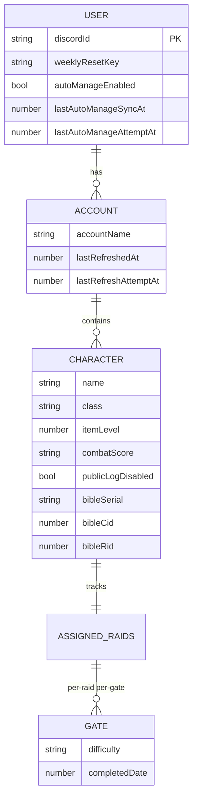
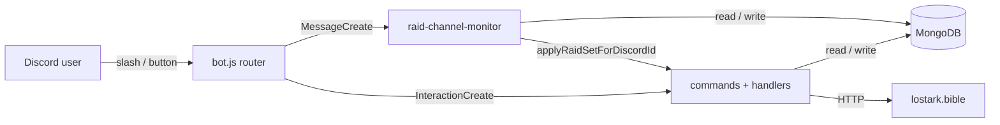

# Artist — Lost Ark Raid Management Bot


**Artist** automates weekly raid-progress tracking for a Lost Ark guild — no more shared spreadsheets. It syncs each member's roster from `lostark.bible`, records raid-gate completion from chat posts or automatic reconciliation against the clear-logs, shows at a glance who still owes which raid, and resets the entire guild every Wednesday at 17:00 VN. Every surface is available in Vietnamese, Japanese, and English.

Beyond progress tracking, Artist ships a **zero-upload web companion** that reads your local `encounters.db` in the browser to power weekly-clear sync, plus raid signup boards, an auction-bid calculator, per-character side-tasks, and weekly gold management — one bot for the entire raid week.

## Contents

- [Features](#features)
- [Commands](#commands)
- [Text-monitor format](#text-monitor-format)
- [Data Model](#data-model)
- [Architecture](#architecture)
- [Environment Variables](#environment-variables)
- [Run Local](#run-local)
- [Railway Deploy](#railway-deploy)
- [Development](#development)
- [Known Limitations](#known-limitations)

## Features

- Slash commands for roster sync, progress view, per-char update, and manager scan
- Text-channel monitor: post `<raid> <difficulty> <character> [gate]`, bot parses + updates + DM confirms
- Auto-sync from lostark.bible logs (opt-in via `/raid-auto-manage action:on`) with a background scheduler that retries stale users about every 30 minutes, OR local-sync mode (`action:local-on`) that reads `encounters.db` via a web companion (SQLite-in-browser, deltas-only POST, no file upload)
- Per-character side-task tracker + roster-level shared-task tracker (`/raid-task`) with auto-reset at 17:00 VN daily / Wed 17:00 VN weekly (Chaos Gate / Field Boss follow UTC-4 schedule)
- Per-character + per-account weekly gold-earned tracker with bound/unbound breakdown, plus `/raid-gold-earner` picker to mark which 6 chars/account earn gold (per Lost Ark's cap)
- Auction bid calculator (`/raid-auction`): given an item's AH listing price (5% sell fee auto-deducted), computes the recommended bid for BOTH 4- and 8-player parties in one embed plus each member's cut and the winner's estimated profit
- Raid signup board preview (`/raid-schedule-preview`): Support/DPS slots, waitlist, RSVP, auto-lock, a lead Manage menu (incl. placement-aware add-member ping + member kick with auto waitlist-promotion), multi-turn (bus) team assignment, a `📊 Turn plan` button (read-only peek, with a `📋 Thu nhỏ` toggle to an all-turns ANSI console showing room/ID/comp), and `show` to resurface a buried board to the channel bottom (with a `🗓 board switcher` that swaps the visible board in-place when the lead runs several in one channel); party size is derived from the selected raid (Act 4/Kazeros = 8, Serca = 4)
- Weekly reset Wed 17:00 VN (catch-up safe) with per-guild announcement
- Monitor-channel auto-cleanup every 30 minutes, with Artist quiet hours 03:00-08:00 VN (bedtime + morning catch-up sweep)
- Raid Manager tier: shorter sync cooldown, `👑` roster header icon, exclusive `/raid-check` Edit flow
- Manager-only roster sharing (`/raid-share grant target:@user`): grantee sees and edits the manager's rosters across `/raid-status`, `/raid-set`, `/raid-task`, and the text parser; revocable any time
- Per-user display language (`/raid-language`): switch Artist's voice between Tiếng Việt (default) and 日本語 (cuter Senko-flavored Artist); persistent across sessions
- Help (`/raid-help`) with dropdown drill-down in vi / jp / en (`language:` slash option for per-call override)

## Commands

All replies are ephemeral (visible only to the caller) unless a command's row notes otherwise.

| Command | Who | What |
|---|---|---|
| `/raid-add-roster` | anyone (self); Raid Manager (`target:` for others) | Fetch a roster from `lostark.bible`, open an interactive picker (per-char toggle buttons + Confirm/Cancel, 5-min session), then save the chosen chars (cap 20/roster) |
| `/raid-edit-roster` | anyone (self) | Edit an existing saved roster: re-fetches bible + opens a merged picker (saved ∪ bible) so you can add new chars or untick saved ones in one shot. Preserves per-char raid completion state. |
| `/raid-status` | anyone (self) | View raid progress, paginated 1 roster/page; roster iLvl/class auto-refreshes in the background and can be refreshed immediately from the Refresh roster button; per-char + per-account weekly gold rollup with bound gold shown via the `🔒` tail, with per-char gold hidden when a specific raid filter is active; Gold view includes a per-character difficulty dropdown that applies immediately before a raid runs or queues for the next weekly reset after it ran; a `🗓️ Raid của tôi` dropdown lists the `/raid-schedule-preview` events you are in (self-join or manager-added) and opens a personal detail (time, room if in comp, your turns + teammates) |
| `/raid-bg` | anyone (self) | Per-user background-image library for `/raid-status` card embeds: `set` (upload 1-4, `action:overwrite` or `extend`, up to a 6-scene library), `view` (interactive one-scene-at-a-time browser with pager), `edit` (replace one scene with a new image, or delete scenes). Storage + sizing details in the Environment Variables section. |
| `/raid-gold-earner` | anyone (self) | Picker to flip the per-character `isGoldEarner` flag (cap 6/account/week per LA). Pre-checks top 6 by iLvl on first open for legacy data; new chars default to ON. |
| `/raid-auction` | anyone (self) | Auction bid calculator for shared raid loot. `market_value:<AH listing in gold>` (+ optional `profit`, default on). Renders bids for BOTH 4- and 8-player parties side by side from one input. Formula ported from la-utils: `floor(0.95 × listing × (N-1)/N)`, ×0.92 in profit mode. The 5% AH sell fee is already baked into the bid (enter listing price as-is). Replies publicly so the whole party sees the bids; input errors stay ephemeral. |
| `/raid-schedule-preview` | `create`/manage/`show`: Raid Manager | Preview command for a public raid signup board. `create`: `raid`, `mode`, `when`, required `skip_notify` (silent mode), optional `auto_lock`/`title` (party size derived from the catalog: Act 4/Kazeros = 8, Serca = 4). Members join from saved rosters (characters that already cleared this raid this week are hidden from both the Join and Add member pickers); the board manages Support/DPS slots, waitlist, RSVP, room visibility, and a lead-only Manage menu for Lock/Unlock, End, Set room, Edit time, Cancel, 🧩 Turns, ➕ Add member, 👋 Kick, and 🗑️ Delete. **Turns** = bus model: the lead arranges signups into multiple turns (the same player can run several) by ticking the signup pool. **Add member** lets the lead add someone directly (pick a user, then an iLvl-eligible character from their roster; works while locked; pings whether they are in comp or waitlist). If that role is full, the added player follows the normal waitlist rules rather than bumping an existing slot-holder. **Kick** drops one or more people (multi-select); dropping a slot-holder auto-promotes the next waitlister. **Delete** hard-removes the event (board + doc, with a confirm) unlike Cancel which freezes a record; last week's events are also auto-purged at the weekly reset. `show` takes an `action`: `📋 Resurface board` (default) reposts your signup board at the channel bottom (delete + repost + repoint, never a stale ghost board; with several active boards in the same channel a `🗓 board switcher` swaps the visible message in-place, and the full board is reposted with every member shown just like create); `📊 Turn plan` opens an ephemeral turn-plan dashboard scoped to your own boards, with a `🗓` dropdown to switch between your raids (an across-raids overview). The turn plan uses the signup-board embed frame; 8-man raids render each turn as two side-by-side parties (1 sup + 3 dps each, unfilled = `＋ trống`), 4-man as one. Members see their own turns via `/raid-status` → `🗓️ Raid của tôi`. End writes clears through `/raid-set` for current comp slot-holders only. |
| `/raid-set` | anyone (self); Raid Manager (rosters they registered via `/raid-add-roster target:`) | Update one character: `complete` / `process <gate>` / `reset`. Manager-registered rosters surface in autocomplete with a 👥 marker so the helper can keep maintaining the registered user's progress. |
| `/raid-check` | Raid Manager | Scan rosters for pending chars; Sync button (bible-log pull for opted-in users), Refresh roster button (iLvl/class pull for the current roster), and Edit button (cascading select); a 📋 teams dropdown lists every active signup board in the guild (any Manager's) and opens its comp + turn plan ephemerally (spills across extra dropdowns past 25 events) |
| `/raid-auto-manage` | anyone (self) | `on` / `off` / `sync` / `status` for bible-log auto-reconcile · `local-on` / `local-off` for the encounters.db web-companion mode (mutex with bible) · `reset` to wipe your own raid progress + sync state (2-step confirm) |
| `/raid-task` | anyone (self) | Side tasks (per-char): `add` (action=`single` or `all`) / `remove` / `clear` daily/weekly tasks per char (cap 3 daily + 5 weekly). Shared tasks (per-roster): `shared-add` / `shared-remove` for Event Shop, Chaos Gate, Field Boss, or custom presets (cap 5 daily + 5 weekly + 5 scheduled). `shared-add all_rosters:true` applies to every saved roster at once. `expires_at:YYYY-MM-DD` auto-hides expired event shops. Toggle complete via `/raid-status` → Side tasks view. Auto-reset 17:00 VN daily / Wed 17:00 VN weekly; scheduled presets (Chaos Gate Mon/Thu/Sat/Sun, Field Boss Tue/Fri/Sun) follow UTC-4 11 AM-5 AM windows. |
| `/raid-channel` | admin | Register monitor channel, toggle schedules, repin welcome |
| `/raid-announce` | admin | List / enable / disable / redirect per-guild announcement types (9 types: weekly-reset, stuck-nudge, set-greeting, hourly-cleanup, artist-bedtime, artist-wakeup, whisper-ack, maintenance-early, maintenance-countdown) |
| `/raid-help` | anyone | Drill-down help (dropdown lists every command). `language:` slash option overrides locale for one call (vi / en / jp). |
| `/raid-language` | anyone (self) | Per-user persistent display language: 🇻🇳 Tiếng Việt (default) or 🇯🇵 日本語 (cuter Artist voice). Switches across every command for that user. |
| `/raid-share` | Raid Manager | `grant` / `revoke` / `list` - share all your rosters with another user (default `permission:edit`). Grantee gets read+write on /raid-status, /raid-set, /raid-task, and text parser; owner exclusivity preserved on /raid-add-roster, /raid-edit-roster, /raid-remove-roster, /raid-auto-manage. |
| `/raid-remove-roster` | anyone (self) | Remove a roster or one character from it |

Raid Manager = Discord user IDs listed in `RAID_MANAGER_ID` (comma-separated). Manager perks: 15s auto-manage sync cooldown (vs 10m), `👑` header icon on their rosters, and exclusive access to `/raid-check`.

## Text-monitor format

Post into the channel registered via `/raid-channel`:

```text
Serca Nightmare Clauseduk            → mark all Serca Nightmare gates done
Kazeros Hard Soulrano G1             → mark G1 only (cumulative: G_N also marks G1..G_{N-1})
Act4 Hard Priscilladuk, Nailaduk     → multi-char in one post
```

Aliases (case-insensitive):

| Kind | Values |
|---|---|
| Raid | `act 4` / `act4` / `armoche` · `kazeros` / `kaz` · `serca` (typo `secra`) · `horizon` / `cathedral` / `hc` |
| Difficulty | `normal` / `nor` / `nm` / `level 1` / `l1` · `hard` / `hm` / `level 2` / `l2` · `nightmare` / `9m` / `level 3` / `l3` |
| Gate | `G1`, `G2`, ... (validated per raid) |
| Separator | space, `+`, or `,` |

Note: `nm` is Normal (not Nightmare). Nightmare only accepts the full word or `9m`.

## Data Model

One MongoDB collection (`users`), one document per Discord user. Accounts and characters nest as subdocuments; raid progress lives on each character.



User document example:

```jsonc
{
  "discordId": "390361918071635968",
  "weeklyResetKey": "2026-W17",
  "autoManageEnabled": true,
  "accounts": [
    {
      "accountName": "Clauseduk",
      "lastRefreshedAt": 1745961200000,
      "characters": [
        {
          "name": "Clauseduk",
          "class": "Paladin",
          "itemLevel": 1743,
          "combatScore": "~4234.35",
          "publicLogDisabled": false,
          "assignedRaids": {
            "armoche": { "G1": { "difficulty": "Hard", "completedDate": 1745961111000 } },
            "kazeros": { },
            "serca":   { }
          }
        }
      ]
    }
  ]
}
```

**Gate System.** Raid is "done" when every official gate has `completedDate > 0` at the selected difficulty. `assignedRaids.<raidKey>` uses `strict: false` so adding G3+ later is migration-free. `/raid-check` places characters in their natural iLvl bucket first (for example Serca Normal is `[1710,1730)`, Hard is `[1730,1740)`, Nightmare is `1740+`), but explicit clears are also shown on the mode they actually cleared and annotated when viewed from another bucket, e.g. `2/2 (Normal Clear)`.

**Solo mode.** Every raid also carries a `solo` mode: a manual-only alias of Normal with the same item-level floor and the same base/bound/unbound gold, but its own stored key and localized label. It is never picked by automatic eligibility (`manualOnly`), and both sync paths preserve it, so a bible or local-sync clear reported as Normal will not overwrite a Solo you set by hand. Solo raids are hidden from `/raid-check` because a solo clear needs no team comp.

**Class map.** 30+ Lost Ark classes mapped from bible internal IDs to display names in `bot/models/Class.js`. Unknown IDs fall back to title-cased raw ID.

**GuildConfig** (second collection) stores per-guild monitor channel, cleanup schedule cursors, bedtime/wake-up dedup keys, and per-announcement enable flags. See `bot/models/guildConfig.js`.

## Architecture

```
LostArk_RaidManage/
|-- bot.js                         # Discord client lifecycle + listeners
|-- bot/
|   |-- commands.js                # Compose root: wires every command/service factory
|   |-- db.js                      # Lazy Mongo connect with DNS fallback
|   |-- app/                       # Boot composition: slash registration, web companion, router registry
|   |-- domain/                    # Static domain catalog data, e.g. raid requirements/gold
|   |-- handlers/                  # Slash command / component handlers by feature
|   |   |-- commands/               # SlashCommandBuilder registry
|   |   |-- local-sync/             # Local-sync buttons / follow-up actions
|   |   |-- meta/                   # Help + language commands
|   |   |-- raid/                   # raid-set/task/share/channel/announce/auto-manage handlers
|   |   |-- raid-check/             # Scan + edit/sync/task-view/all-mode UI
|   |   |-- raid-status/            # Status view, task UI, sync, filters
|   |   `-- roster/                 # Add/edit/remove roster + gold-earner handlers
|   |-- models/                    # Mongoose schemas + compatibility model exports
|   |   |-- user.js
|   |   |-- guildConfig.js
|   |   |-- Raid.js                 # Backward-compatible wrapper for domain/raid-catalog
|   |   |-- Class.js
|   |   `-- ArtistEmoji.js
|   |-- services/                  # Cross-command services grouped by concern
|   |   |-- access/                 # Manager allowlist + roster-share access checks
|   |   |-- auto-manage/            # Bible auto-sync core/status helpers
|   |   |-- discord/                # Emoji bootstrap, interaction router, identity cache
|   |   |-- i18n/                   # Translation resolver + user/guild language cache
|   |   |-- local-sync/             # Web companion API, tokens, catalog, preview, apply logic
|   |   |-- raid/                   # Schedulers, weekly reset, channel monitor, raid view snapshots
|   |   `-- roster/                 # Bible roster fetch + refresh cooldown logic
|   |-- shared/                    # Generic reusable helpers
|   `-- utils/
|       `-- raid/                  # Pure raid helpers grouped by reuse surface
|           |-- common/             # Names, labels, embeds, character normalization
|           |-- queries/            # Mongo query builders for raid views
|           |-- schedule/           # Announcement registry, maintenance/quiet-hour/reset math
|           `-- tasks/              # Side-task/shared-task helpers + task view layout
|-- web/                            # Local Sync companion UI served by local-sync/http-server
|-- assets/
|   |-- class-icons/
|   `-- artist-icons/
|-- scripts/
|   |-- deploy-commands.js         # Standalone slash-command registration (REST)
|   `-- invert-icon.py
|-- test/                          # node --test, pure functions via __test exports
|-- Dockerfile
|-- railway.toml
|-- .env.example
`-- package.json
```
Four composition principles:

1. **Factory + dep injection.** Every command/service exports `create<Name>(deps)` so `bot/commands.js` wires the object graph once at boot. Tests instantiate with stubs.
2. **Registry as single source of truth.** `ANNOUNCEMENT_REGISTRY`, `RAID_REQUIREMENTS`, `RAID_MANAGER_ID` all live in exactly one place and are referenced from docs, HELP_SECTIONS, and runtime logic.
3. **Services orchestrate, utils calculate.** Long-running DB/Discord flows stay in `services/*`; pure raid math and view helpers live in `utils/raid/*` so `/raid-status`, `/raid-check`, `/raid-task`, schedulers, and Local Sync reuse the same calculations.
4. **Shared write paths.** `applyRaidSetForDiscordId` is reused by `/raid-set`, the text monitor, `/raid-check` Edit, and Local Sync apply logic - new UIs never re-implement raid mutation.

Interaction flow:



Weekly reset runs every 30 minutes (UTC-based trigger: Wed ≥ 10:00 UTC). Per-user dedup via `weeklyResetKey` (ISO week string). Catch-up safe: a bot offline through the reset window fires on the next tick.

## Environment Variables

| Var | Required | Default | Notes |
|---|:---:|---|---|
| `DISCORD_TOKEN` | ✅ | - | Bot token from Developer Portal |
| `CLIENT_ID` | ✅ | - | Application ID for slash-command registration |
| `GUILD_ID` | ✅ | - | Target guild (slash commands are guild-scoped) |
| `MONGO_URI` | ✅ | - | MongoDB connection string |
| `MONGO_DB_NAME` | ❌ | `manage` | Database name |
| `MONGO_ENSURE_INDEXES` | ❌ | `true` | Set `false` if indexes are managed in Atlas UI |
| `DNS_SERVERS` | ❌ | `8.8.8.8,1.1.1.1` | DNS fallback when Atlas SRV lookup fails |
| `TEXT_MONITOR_ENABLED` | ❌ | `true` | `false` skips the privileged MessageContent intent + listener |
| `RAID_MANAGER_ID` | ❌ (recommended) | empty | Comma-separated user IDs. Empty = `/raid-check` rejects everyone; manager perks never apply |
| `AUTO_MANAGE_DAILY_DISABLED` | ❌ | `false` | Killswitch for the background bible auto-sync scheduler (no redeploy needed) |

`/raid-bg` (background image for `/raid-status` embeds) needs no admin setup and no env var · uploaded bytes are normalized to a 16:9 (1600x900) JPEG frame (≤ 2 MB per stored image) and persisted on the `userbackgrounds` Mongo collection (separate from the User doc). Users can `/raid-bg set` 1-4 images with `action:overwrite` (replace the library) or `action:extend` (append) up to a **6-scene library** (decoupled from roster count); `/raid-bg view` is an interactive browser (one large scene at a time, a scene dropdown + ◀/▶ pager); `/raid-bg edit` replaces a scene (attach an image, then pick the slot) or deletes scenes (pick a slot, or clear all) via an ephemeral picker. The bot maps saved images evenly or randomly across rosters (extra scenes are spares) and attaches the matching one as the embed image. Shared roster pages use the viewer's own background pool, not the roster owner's.

Discord Developer Portal: flip `Bot → Privileged Gateway Intents → Message Content Intent` on to let the text monitor read posts, or set `TEXT_MONITOR_ENABLED=false` to run slash-command-only.

## Run Local

```bash
npm install
cp .env.example .env        # then edit with real values
npm run deploy:commands     # first time only, or when slash schema changes
npm start                   # or: npm run dev (node --watch)
npm test                    # node --test on test/
```

Logic-only changes (inside a command, no new option or name tweak) don't require `deploy:commands` — Discord keeps the cached schema.

## Railway Deploy

1. Push to the GitHub branch Railway tracks (`main`).
2. Create the Railway service → link repo.
3. In the service's **Variables** tab, set every env var (minimum: `DISCORD_TOKEN`, `CLIENT_ID`, `GUILD_ID`, `MONGO_URI`).
4. Railway builds from `Dockerfile` (node:20-slim, `npm install --omit=dev`) and starts via `node bot.js`.
5. `railway.toml` sets restart policy = `ON_FAILURE`, max 3 retries.

The bot **re-registers slash commands on every boot** (`ClientReady` handler calls `rest.put(applicationGuildCommands, ...)`), so a push → Railway redeploy → new schema lands without any separate CLI step. Registration failure logs a warning and the bot boots with the previous cached schema — fail-soft. `scripts/deploy-commands.js` stays around only for dev-machine force-registers.

## Development

- Run tests before pushing: `npm test`
- Commits auto-deploy via Railway on push to `main` — think of `main` as production
- No CI pipeline; test suite is the only gate
- Prefer editing existing files; don't create documentation files unless asked

## Known Limitations

- `/raid-add-roster` scrapes `lostark.bible` HTML + inline SSR JSON. Layout changes upstream will break the regex and DOM selectors in `bot/services/roster/fetch.js`.
- Slash commands are guild-scoped. Enabling the bot in more servers needs one `deploy-commands` run per `GUILD_ID`.
- `RAID_MANAGER_ID` rotation requires a redeploy. There's no `/admin add-manager` command.
- Bible auto-sync can't reach a character with Public Log OFF. The `/raid-check` Edit flow is the only raid-progress write path for those; the Refresh roster buttons only update roster metadata such as iLvl/class.
- `MessageContent` is a Discord privileged intent. Large-guild deployments (100+ members without manual approval) need to set `TEXT_MONITOR_ENABLED=false` until Discord grants intent access.
- One Mongo cluster, one collection per kind; no sharding or read replicas. The per-user footprint is small (≤ 30 chars across ≤ 5 accounts) so this fits comfortably for the 2-person deployment.

## License

Private project, no license.
