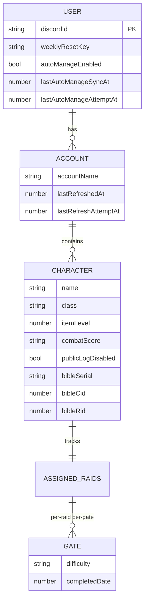
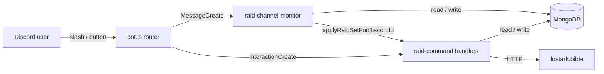

# Lost Ark Raid Management Bot

Discord bot tracking weekly raid progress for a small Lost Ark roster. Syncs characters from `lostark.bible`, parses raid-clear posts in a configured channel, auto-reconciles progress against bible clear-logs, and handles the Wednesday 17:00 VN weekly reset.

## Features

- Slash commands for roster sync, progress view, per-char update, and manager scan
- Text-channel monitor: post `<raid> <difficulty> <character> [gate]`, bot parses + updates + DM confirms
- Auto-sync from lostark.bible logs (opt-in via `/raid-auto-manage`) with a passive 24h scheduler
- Weekly reset Wed 17:00 VN (catch-up safe) with per-guild announcement
- Monitor-channel auto-cleanup every 30 minutes, with Artist quiet hours 03:00-08:00 VN (bedtime + morning catch-up sweep)
- Raid Manager tier: shorter sync cooldown, `👑` roster header icon, exclusive `/raid-check` Edit flow
- Bilingual help (`/raid-help`) with dropdown drill-down

## Commands

| Command | Who | What |
|---|---|---|
| `/add-roster` | anyone | Sync top-N characters (by combat score) from `lostark.bible` into one account |
| `/raid-status` | anyone (self) | View raid progress, paginated 1 roster/page; lazy iLvl refresh (2h cache) |
| `/raid-set` | anyone (self) | Update one character: `complete` / `process <gate>` / `reset` |
| `/raid-check` | Raid Manager | Scan rosters for pending chars; Sync button (bible pull) + Edit button (cascading select) |
| `/raid-auto-manage` | anyone (self) | `on` / `off` / `sync` / `status` for automated bible log reconciliation |
| `/raid-channel` | admin | Register monitor channel, toggle schedules, repin welcome |
| `/raid-announce` | admin | List / enable / disable / redirect per-guild announcement types |
| `/raid-help` | anyone | Drill-down help (dropdown lists every command) |
| `/remove-roster` | anyone (self) | Remove a roster or one character from it |

Raid Manager = Discord user IDs listed in `RAID_MANAGER_ID` (comma-separated). Manager perks: 30s auto-manage sync cooldown (vs 15m), `👑` header icon on their rosters, and exclusive access to `/raid-check`.

## Text-monitor format

Post into the channel registered via `/raid-channel`:

```text
Serca Nightmare Clauseduk            → mark all Serca Nightmare gates done
Kazeros Hard Soulrano G1             → mark G1 only (cumulative: G_N also marks G1..G_{N-1})
Act4 Hard Priscilladuk, Nailaduk     → multi-char in one post
```

Aliases (case-insensitive):

| Kind | Values |
|---|---|
| Raid | `act 4` / `act4` / `armoche` · `kazeros` / `kaz` · `serca` (typo `secra`) |
| Difficulty | `normal` / `nor` / `nm` · `hard` / `hm` · `nightmare` / `9m` |
| Gate | `G1`, `G2`, ... (validated per raid) |
| Separator | space, `+`, or `,` |

Note: `nm` is Normal (not Nightmare). Nightmare only accepts the full word or `9m`.

## Data Model

One MongoDB collection (`users`), one document per Discord user. Accounts and characters nest as subdocuments; raid progress lives on each character.



User document example:

```jsonc
{
  "discordId": "390361918071635968",
  "weeklyResetKey": "2026-W17",
  "autoManageEnabled": true,
  "accounts": [
    {
      "accountName": "Clauseduk",
      "lastRefreshedAt": 1745961200000,
      "characters": [
        {
          "name": "Clauseduk",
          "class": "Paladin",
          "itemLevel": 1743,
          "combatScore": "~4234.35",
          "publicLogDisabled": false,
          "assignedRaids": {
            "armoche": { "G1": { "difficulty": "Hard", "completedDate": 1745961111000 } },
            "kazeros": { },
            "serca":   { }
          }
        }
      ]
    }
  ]
}
```

**Gate System.** Raid is "done" when every official gate has `completedDate > 0` at the selected difficulty. `assignedRaids.<raidKey>` uses `strict: false` so adding G3+ later is migration-free. `/raid-check` places characters in their natural iLvl bucket first (for example Serca Normal is `[1710,1730)`, Hard is `[1730,1740)`, Nightmare is `1740+`), but explicit clears are also shown on the mode they actually cleared and annotated when viewed from another bucket, e.g. `2/2 (Normal Clear)`.

**Class map.** 30+ Lost Ark classes mapped from bible internal IDs to display names in `src/data/Class.js`. Unknown IDs fall back to title-cased raw ID.

**GuildConfig** (second collection) stores per-guild monitor channel, cleanup schedule cursors, bedtime/wake-up dedup keys, and per-announcement enable flags. See `src/models/guildConfig.js`.

## Architecture

```
LostArk_RaidManage/
├── src/
│   ├── bot.js                      # Discord client + interaction router + listeners
│   ├── index.js                    # Thin wrapper: require("./bot")
│   ├── deploy-commands.js          # Standalone slash-command registration (REST)
│   ├── raid-command.js             # Compose root: wires every command + service
│   │
│   ├── commands/                   # One file per slash command (factory pattern)
│   │   ├── add-roster.js
│   │   ├── raid-announce.js
│   │   ├── raid-auto-manage.js
│   │   ├── raid-channel.js
│   │   ├── raid-check.js           # Scan + Sync + Edit cascading select
│   │   ├── raid-help.js
│   │   ├── raid-set.js             # applyRaidSetForDiscordId shared write path
│   │   ├── raid-status.js
│   │   ├── remove-roster.js
│   │   └── definitions.js          # SlashCommandBuilder registry
│   │
│   ├── services/                   # Cross-command concerns
│   │   ├── auto-manage-core.js     # Bible log gather + apply + cooldown slot
│   │   ├── auto-manage-sync.js     # Status-side piggyback helper
│   │   ├── manager.js              # RAID_MANAGER_ID allowlist + cooldown picker
│   │   ├── raid-channel-monitor.js # Text-monitor parser + cleanup + welcome embed
│   │   ├── raid-schedulers.js      # 30-min cleanup tick, bedtime/wake-up, daily auto-sync
│   │   ├── roster-fetch.js         # lostark.bible HTML scrape
│   │   └── roster-refresh.js       # 2h lazy refresh with failure cooldown
│   │
│   ├── models/                     # Mongoose schemas + indexes
│   │   ├── user.js
│   │   └── guildConfig.js
│   │
│   ├── data/                       # Pure constant lookup tables (no Mongoose)
│   │   ├── Raid.js                 # RAID_REQUIREMENTS (iLvl floors + gate lists)
│   │   └── Class.js                # Bible class ID -> display name map
│   │
│   ├── raid/                       # Pure helpers / registries
│   │   ├── shared.js               # Time, name, format utils
│   │   ├── announcements.js        # Announcement registry (single source of truth)
│   │   ├── character.js            # Character + raid normalization (20 helpers + RAID_REQUIREMENT_MAP)
│   │   ├── raid-check-query.js     # /raid-check Mongo query (filter, projection, iLvl-range)
│   │   └── scheduling.js           # Announcement timing + scheduler-tick math (factory, deferred deps)
│   │
│   ├── db.js                       # Lazy Mongo connect with DNS fallback
│   └── weekly-reset.js             # 30-min tick, Wed 10:00 UTC boundary
│
├── test/
│   └── raid-check-snapshot.test.js # node --test, pure functions via __test exports
├── Dockerfile                      # node:20-slim, npm install --omit=dev
├── railway.toml                    # Deploy policy
├── .env.example
└── package.json
```

Three composition principles:

1. **Factory + dep injection.** Every command/service exports `create<Name>(deps)` so `raid-command.js` wires the object graph once at boot. Tests instantiate with stubs.
2. **Registry as single source of truth.** `ANNOUNCEMENT_REGISTRY`, `RAID_REQUIREMENTS`, `RAID_MANAGER_ID` all live in exactly one place and are referenced from docs, HELP_SECTIONS, and runtime logic.
3. **Shared write paths.** `applyRaidSetForDiscordId` is reused by `/raid-set`, the text monitor, and the `/raid-check` Edit flow — new UIs never re-implement raid mutation.

Interaction flow:



Weekly reset runs every 30 minutes (UTC-based trigger: Wed ≥ 10:00 UTC). Per-user dedup via `weeklyResetKey` (ISO week string). Catch-up safe: a bot offline through the reset window fires on the next tick.

## Environment Variables

| Var | Required | Default | Notes |
|---|:---:|---|---|
| `DISCORD_TOKEN` | ✅ | - | Bot token from Developer Portal |
| `CLIENT_ID` | ✅ | - | Application ID for slash-command registration |
| `GUILD_ID` | ✅ | - | Target guild (slash commands are guild-scoped) |
| `MONGO_URI` | ✅ | - | MongoDB connection string |
| `MONGO_DB_NAME` | ❌ | `manage` | Database name |
| `MONGO_ENSURE_INDEXES` | ❌ | `true` | Set `false` if indexes are managed in Atlas UI |
| `DNS_SERVERS` | ❌ | `8.8.8.8,1.1.1.1` | DNS fallback when Atlas SRV lookup fails |
| `TEXT_MONITOR_ENABLED` | ❌ | `true` | `false` skips the privileged MessageContent intent + listener |
| `RAID_MANAGER_ID` | ❌ (recommended) | empty | Comma-separated user IDs. Empty = `/raid-check` rejects everyone; manager perks never apply |
| `AUTO_MANAGE_DAILY_DISABLED` | ❌ | `false` | Killswitch for the 24h passive auto-sync scheduler (no redeploy needed) |

Discord Developer Portal: flip `Bot → Privileged Gateway Intents → Message Content Intent` on to let the text monitor read posts, or set `TEXT_MONITOR_ENABLED=false` to run slash-command-only.

## Run Local

```bash
npm install
cp .env.example .env        # then edit with real values
npm run deploy:commands     # first time only, or when slash schema changes
npm start                   # or: npm run dev (node --watch)
npm test                    # node --test on test/
```

Logic-only changes (inside a command, no new option or name tweak) don't require `deploy:commands` — Discord keeps the cached schema.

## Railway Deploy

1. Push to the GitHub branch Railway tracks (`main`).
2. Create the Railway service → link repo.
3. In the service's **Variables** tab, set every env var (minimum: `DISCORD_TOKEN`, `CLIENT_ID`, `GUILD_ID`, `MONGO_URI`).
4. Railway builds from `Dockerfile` (node:20-slim, `npm install --omit=dev`) and starts via `node src/bot.js`.
5. `railway.toml` sets restart policy = `ON_FAILURE`, max 3 retries.

The bot **re-registers slash commands on every boot** (`ClientReady` handler calls `rest.put(applicationGuildCommands, ...)`), so a push → Railway redeploy → new schema lands without any separate CLI step. Registration failure logs a warning and the bot boots with the previous cached schema — fail-soft. `deploy-commands.js` stays around only for dev-machine force-registers.

## Development

- Run tests before pushing: `npm test`
- Commits auto-deploy via Railway on push to `main` — think of `main` as production
- No CI pipeline; test suite is the only gate
- Prefer editing existing files; don't create documentation files unless asked

## Known Limitations

- `/add-roster` scrapes `lostark.bible` HTML + inline SSR JSON. Layout changes upstream will break the regex and DOM selectors in `src/services/roster-fetch.js`.
- Slash commands are guild-scoped. Enabling the bot in more servers needs one `deploy-commands` run per `GUILD_ID`.
- `RAID_MANAGER_ID` rotation requires a redeploy. There's no `/admin add-manager` command.
- Bible auto-sync can't reach a character with Public Log OFF. The `/raid-check` Edit flow is the only write path for those; `publicLogDisabled` flags them so leaders can still edit.
- `MessageContent` is a Discord privileged intent. Large-guild deployments (100+ members without manual approval) need to set `TEXT_MONITOR_ENABLED=false` until Discord grants intent access.
- One Mongo cluster, one collection per kind; no sharding or read replicas. The per-user footprint is small (≤ 30 chars across ≤ 5 accounts) so this fits comfortably for the 2-person deployment.

## License

Private project, no license.
